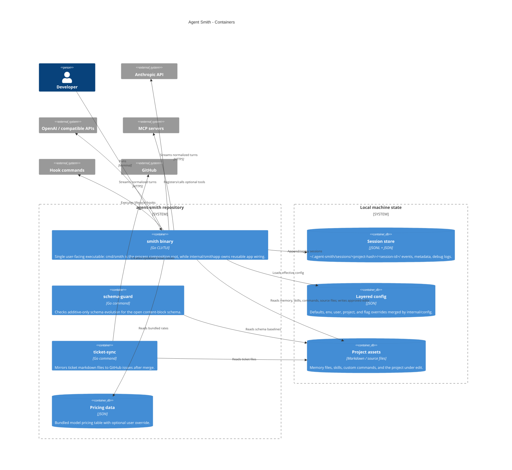

# Containers (C4 level 2)

This view splits Agent Smith into runtime containers. Most production behavior is in one static Go binary; separate command packages provide repository maintenance utilities.

## Container inventory

| Container | Code | Criticality | Notes |
|---|---|---:|---|
| `smith` binary | `cmd/smith`, `internal/smithapp`, `internal/*`, `schema` | Critical | Main product. `cmd/smith` stays thin around process entry, streams, TTY detection, flags, and the command tree; reusable wiring for the router, provider/model, session, and built-in tools lives in `internal/smithapp`. The TUI, headless CLI, shared command handlers, agent loop, providers, tools, and storage remain in-process. See [Core components](core-components.md) for C4 level 3. |
| Session store | `internal/session`, `internal/eventlog` | Critical | Project-scoped durable JSONL event log plus small metadata. This is the audit/replay substrate. See [Core components](core-components.md). |
| Provider APIs | `internal/provider`, `internal/provider/anthropic`, `internal/provider/openai` | Critical | External systems, but critical to the harness boundary because all vendor wire formats normalize into one stream. See [Core components](core-components.md). |
| Tool/capability integrations | `internal/tool`, `internal/mcp`, `internal/hook`, `internal/skill`, `internal/customcmd`, `internal/memory` | Important | Extension surface for local action and reusable context. Covered at component level because tools are central to safety and observability. |
| `schema-guard` | `cmd/schema-guard`, `internal/schemaguard` | Supporting | Repository utility for additive schema discipline; level 2 is enough. |
| `ticket-sync` | `cmd/ticket-sync` | Supporting | Project-management automation; level 2 is enough. |
| Pricing data | `internal/cost/data/pricing.json` | Supporting | Data file used by cost reporting and budget checks; level 2 is enough. |
