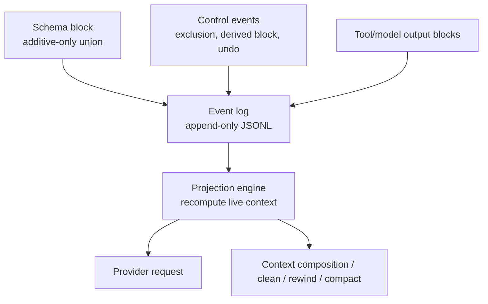
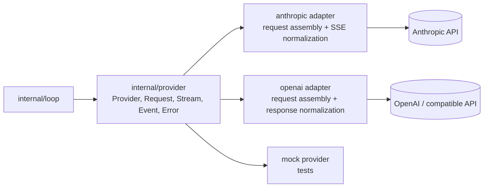
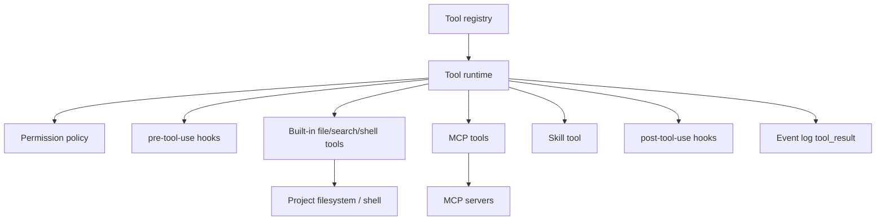

# Core components (C4 level 3)

This page drills into the critical and important containers from [Containers](containers.md). The components are Go packages unless noted otherwise.

## `smith` binary components

```mermaid
C4Component
    title Agent Smith - smith binary components

    Container_Boundary(smith, "smith binary") {
        Component(cli, "CLI router", "cmd/smith + internal/cli", "Builds noun-grouped subcommands and bare TUI launch.")
        Component(tui, "TUI face", "internal/tui", "Interactive terminal UI, command palette, meters, transcript, permission prompts.")
        Component(controller, "Session controller", "cmd/smith", "Wires providers, tools, config, sessions, commands, and loop for one active chat session.")
        Component(commands, "Command registry", "internal/command + feature packages", "Shared slash-command and CLI command descriptors/handlers.")
        Component(loop, "Agent loop", "internal/loop", "Projects context, streams provider turns, dispatches tools, retries, and enforces budgets.")
        Component(projection, "Projection engine", "internal/projection", "Computes live model-facing context from append-only events and control events.")
        Component(eventlog, "Event log", "internal/eventlog", "Append-only in-memory/disk JSONL log of schema blocks.")
        Component(schema, "Block schema", "schema", "Additive-only content-block union used by logs, providers, tools, and projections.")
        Component(session, "Session store", "internal/session", "Project-scoped session directory, metadata, and log opening/listing.")
        Component(provider, "Provider abstraction", "internal/provider", "Normalized request/stream/error interface for all model vendors.")
        Component(adapters, "Provider adapters", "internal/provider/anthropic, internal/provider/openai", "Vendor request assembly and stream normalization.")
        Component(tools, "Tool runtime and registry", "internal/tool + internal/tool/builtin", "Validates, gates, executes, truncates, and logs tool calls/results.")
        Component(capability, "Capability layer", "internal/memory, skill, customcmd, hook, mcp, subagent", "Portable context/config and external extension mechanisms.")
        Component(cost, "Cost and budget", "internal/cost, internal/budget", "Pricing, usage summarization, rendering, and budget state.")
        Component(config, "Layered config", "internal/config", "Merges defaults, env, user/project files, and flags with provenance.")
    }

    System_Ext(anthropic, "Anthropic API")
    System_Ext(openai, "OpenAI / compatible APIs")
    System_Ext(localfs, "Project files and ~/.agent-smith")
    System_Ext(mcp, "MCP servers")
    System_Ext(hooks, "Hook commands")

    Rel(cli, controller, "Starts interactive/headless sessions")
    Rel(tui, controller, "Calls Runner/Meta/Meter seams and command handlers")
    Rel(controller, config, "Loads")
    Rel(controller, session, "Creates/opens/resumes")
    Rel(controller, commands, "Builds shared registry")
    Rel(controller, loop, "Builds and invokes")
    Rel(controller, tools, "Registers built-ins, MCP tools, skill tool")
    Rel(controller, capability, "Loads memory, skills, hooks, MCP, custom commands")
    Rel(loop, projection, "Projects each turn")
    Rel(loop, provider, "Sends request and consumes stream")
    Rel(provider, adapters, "Implemented by")
    Rel(adapters, anthropic, "HTTPS stream")
    Rel(adapters, openai, "HTTPS stream")
    Rel(loop, tools, "Dispatches tool calls")
    Rel(loop, cost, "Checks budget and emits budget events")
    Rel(tools, eventlog, "Appends tool results")
    Rel(loop, eventlog, "Appends user/assistant/reasoning/tool-call blocks")
    Rel(projection, eventlog, "Reads events")
    Rel(eventlog, schema, "Stores blocks")
    Rel(session, eventlog, "Owns disk-backed logs")
    Rel(session, localfs, "Reads/writes session files")
    Rel(capability, localfs, "Reads/writes project assets")
    Rel(capability, mcp, "Connects/registers tools")
    Rel(capability, hooks, "Runs subprocess hooks")
```

## Data-substrate components

Key rules:

| Rule | Implementation seam | Why it matters |
|---|---|---|
| Blocks are the interchange unit. | `schema.Block` and friends. | Providers, tools, sessions, and commands all speak the same substrate. |
| Logs append; they do not update/delete. | `internal/eventlog.Log.Append`. | Edits are auditable, reversible, and crash-safe. |
| Context is projected, not stored. | `internal/projection.Project`. | `/clean`, `/rewind`, `/compact`, and replay can derive views without mutating history. |
| Schema evolution is additive-only. | `schema`, `cmd/schema-guard`, `internal/schemaguard`. | Downstream consumers can build on a stable data API. |

## Provider components

The loop depends only on normalized provider events and typed provider errors. Vendor-specific request shapes, cache behavior, usage accounting, and streaming deltas stay inside adapters.

## Tool and capability components

Tool calls are always represented as schema blocks. The runtime validates arguments, asks permission, applies hooks, bounds execution, truncates excessive output, records a linked `tool_result`, and returns that result to the loop.
