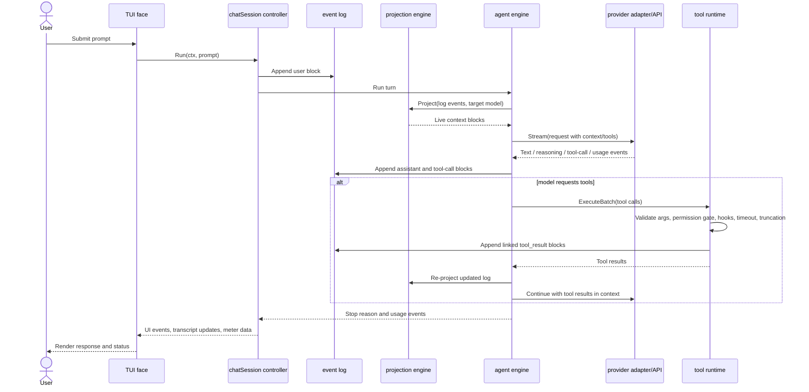
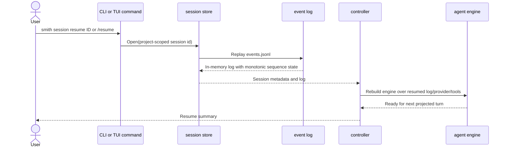

# Runtime flows

These sequence diagrams complement the C4 views with the most important execution paths.

## Interactive turn



## `/clean` preview and apply

```mermaid
sequenceDiagram
    actor User
    participant CleanCommand as clean command handler
    participant ProjectionEngine as projection engine
    participant CleanPlanner as clean planner
    participant EventLog as event log

    User->>CleanCommand: /clean <handle>...
    CleanCommand->>ProjectionEngine: Project current log
    ProjectionEngine-->>CleanCommand: Live and excluded blocks
    CleanCommand->>CleanPlanner: Build removal plan
    CleanPlanner-->>CleanCommand: Preview: blocks, warnings, reclaimed tokens/cost
    CleanCommand-->>User: Show preview; wait for --apply/--cancel
    User->>CleanCommand: /clean --apply
    CleanCommand->>EventLog: Append exclusion event derived from target blocks
    CleanCommand->>ProjectionEngine: Re-project log
    ProjectionEngine-->>CleanCommand: Updated context with excluded blocks visible as excluded
    CleanCommand-->>User: Show applied summary
```

## Session resume



## Headless `smith run`

```mermaid
sequenceDiagram
    actor Script
    participant CLIRouter as CLI router
    participant HeadlessRunner as headless runner
    participant ChatController as session wiring
    participant AgentEngine as agent engine
    participant OutputRenderer as stdout and stderr renderer

    Script->>CLIRouter: smith run "prompt" --output json|plain|stream-json
    CLIRouter->>HeadlessRunner: Parse prompt, config, output mode
    HeadlessRunner->>ChatController: Create/open session, providers, tools, hooks
    ChatController->>AgentEngine: Run prompt to stop condition
    AgentEngine-->>HeadlessRunner: Normalized UI events and final state
    HeadlessRunner->>OutputRenderer: Write result to stdout; diagnostics to stderr
```
