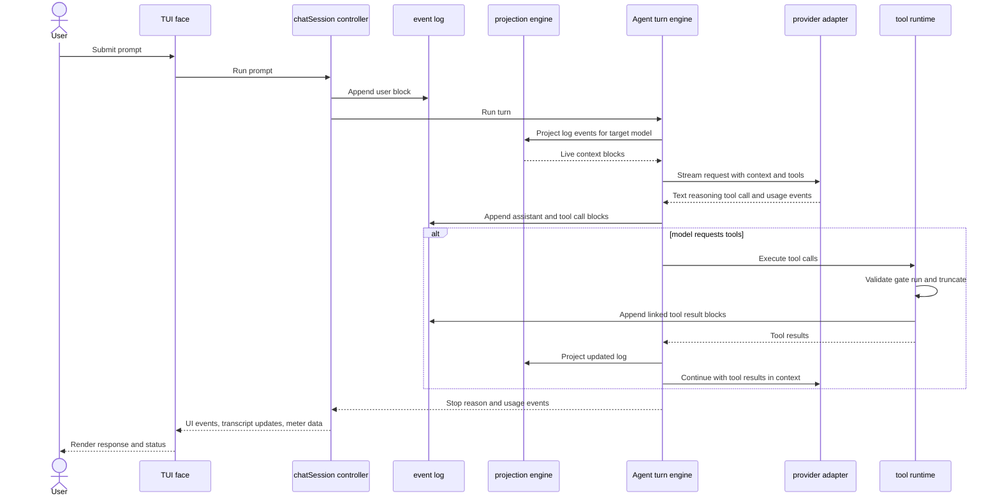
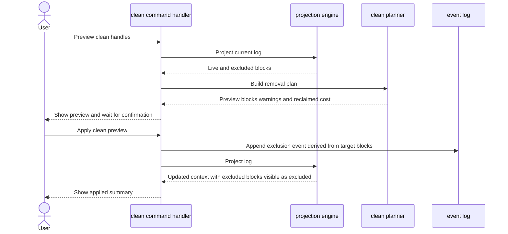
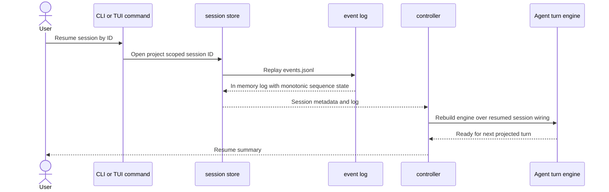
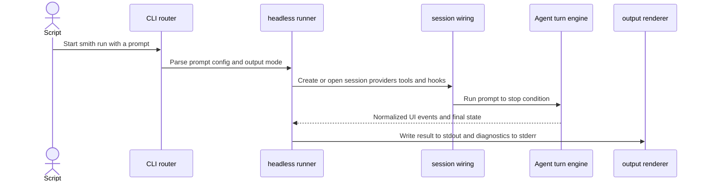

# Runtime flows

These sequence diagrams complement the C4 views with the most important execution paths.

## Interactive turn

## `/clean` preview and apply

## Session resume

## Headless `smith run`

