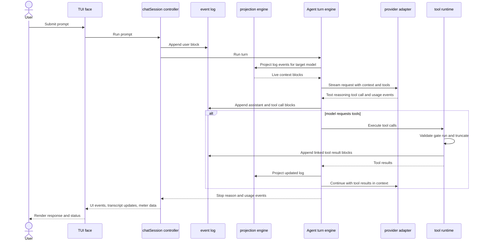
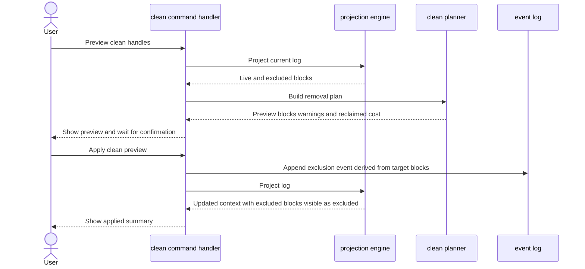
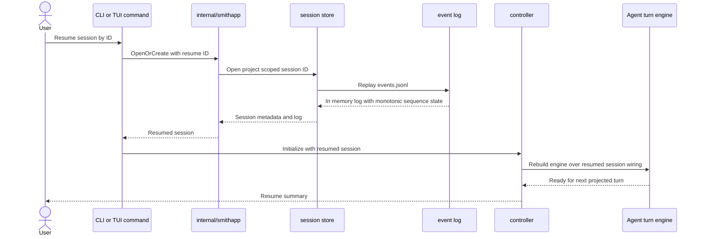
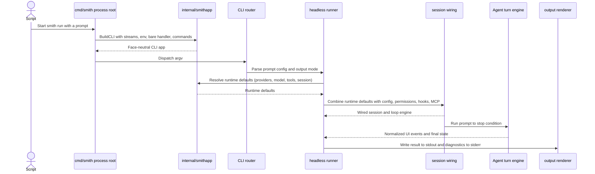
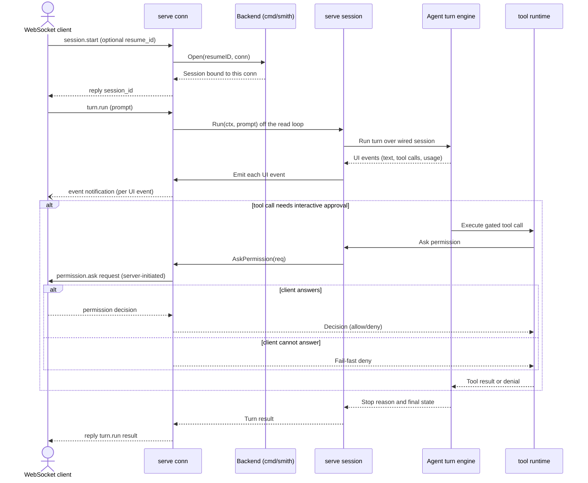

# Runtime flows

These sequence diagrams complement the C4 views with the most important execution paths.

## Interactive turn

## `/clean` preview and apply

## Session resume

## Headless `smith run`

## `smith serve` turn over JSON-RPC/WebSocket

The `internal/serve` face exposes the same face-agnostic loop to programmatic
clients (the web GUI AS-078, the Viscose extension AS-081). Client→server calls
are JSON-RPC requests (`session.start`, `turn.run`, `turn.cancel`,
`session.list`); turn output streams back as server-initiated `event`
notifications; an ask-mode permission prompt (AS-016) is a server-initiated
`permission.ask` request that blocks the turn until the client answers, and
fails fast if it cannot.

