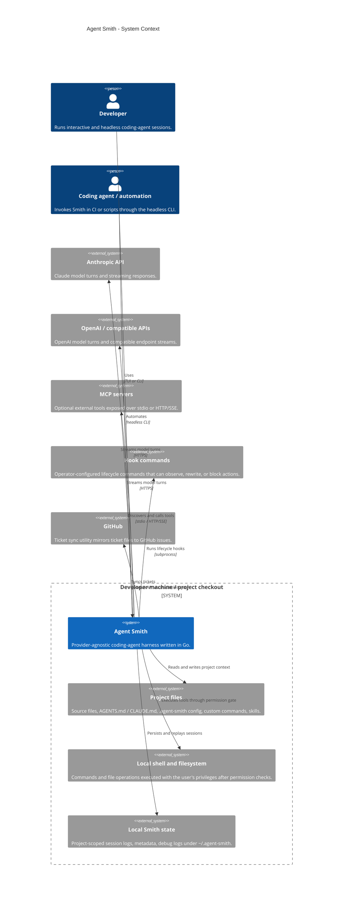

# System context (C4 level 1)

Agent Smith is a local, provider-agnostic coding-agent harness. It runs as a Go binary on a developer workstation, orchestrates model providers and tools, and persists project-scoped sessions as an open append-only data substrate.

## Architectural responsibilities

| Actor/system | Responsibility | Important constraints |
|---|---|---|
| Developer | Starts sessions, approves risky actions, inspects context and cost. | Smith is not an OS sandbox; it relies on user approval and local policy. |
| Agent Smith | Owns context projection, provider normalization, tool orchestration, permissions, cost/accounting, and local persistence. | Must keep session data append-only and schema evolution additive-only. |
| Model providers | Produce model output and tool calls through vendor-specific streaming APIs. | Provider details are normalized behind `internal/provider`. |
| Local tools | Read files, search, and run shell commands. | Tool execution is gated, bounded, logged, and projected like any other block. |
| Local state | Stores session metadata and JSONL event logs. | Event logs are durable audit artifacts and are never edited in place. |
| MCP servers and hooks | Extend Smith with optional tools and lifecycle automation. | Failures should degrade gracefully and remain visible. |
